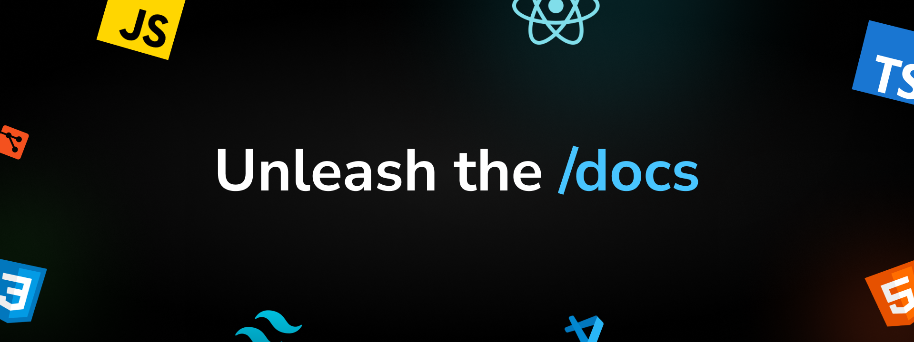

# docs

A curated documentation and learning-materials repository focused on web development.

## What this repository delivers

- **Structured documents** on core frontend topics.
- **Beginner-friendly learning notes** that break concepts into practical explanations.
- **Course-style materials** organized by technology (HTML, JavaScript, React, Next.js, and Material UI).
- **Visual references** (diagrams and screenshots) to support understanding.

## Learning coverage

This repository includes:

- foundational setup guidance before starting development,
- HTML basics, semantics, boilerplate, entities, and tags,
- JavaScript fundamentals and practical patterns,
- Git concepts and command references,
- framework-oriented learning paths through dedicated course content.

## Content structure

- `content/` → topic-wise documents and explainers
- `courses/` → technology-specific course materials and metadata
- `public/internals/` → supporting visuals used in learning documents

## Purpose

The goal of this repository is to deliver clear, reusable documents and learning resources that can be read directly on the deployed site and used as a consistent study reference.
